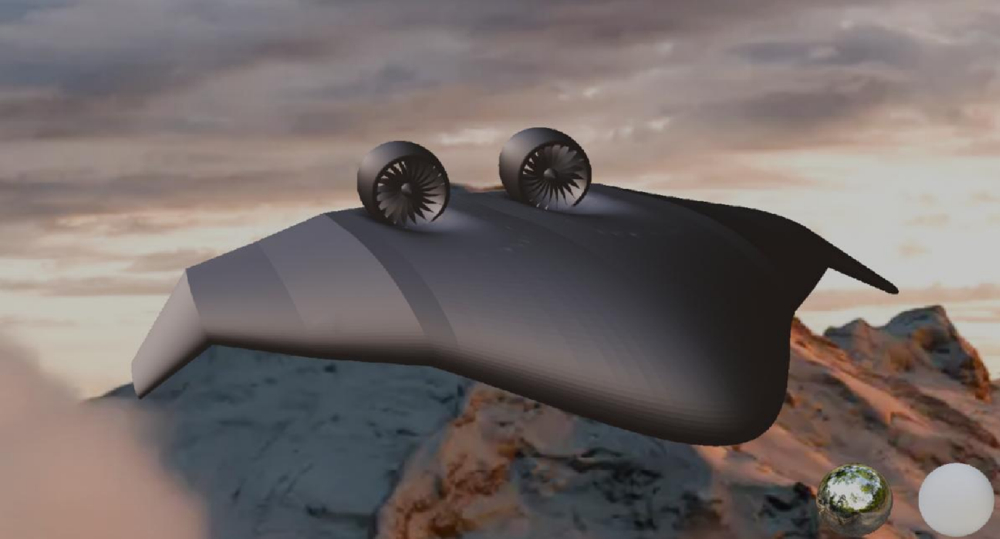
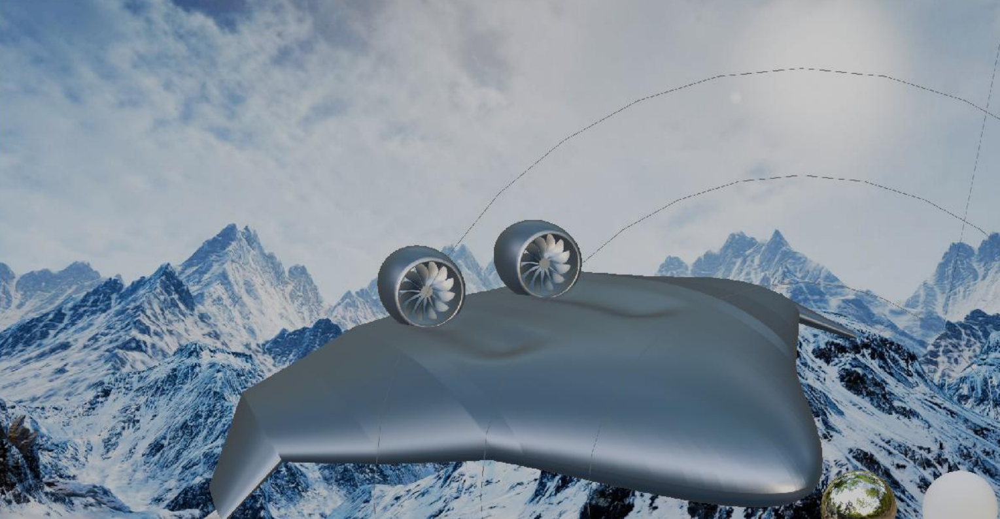

# CHARON — Blended Wing Body UAV with Boundary Layer Ingestion

CHARON is a conceptual **Blended Wing Body (BWB) unmanned aircraft** developed
as an integrated aerodynamic design and propulsion–airframe investigation.

The project combines aerodynamic optimization, custom computational tools,
XFOIL/XFLR5 modelling, OpenFOAM CFD and Electric Ducted Fan integration to
investigate the aerodynamic behaviour of a BWB configuration and the effects
of progressively integrating the propulsion system into the aircraft flow field.

The work originated as an undergraduate aerospace engineering thesis and is
presented here as a technical portfolio documenting the methodology,
computational architecture and principal engineering results.

### Configuration 1 — Initial EDF Integration

<p align="center">
  
</p>

### Configuration 2 — Refined BLI Configuration

<p align="center">
  
</p>

---

## Project Overview

The project followed a progressive engineering workflow:

**Parametric BWB design**  
↓  
**CMA-ES aerodynamic optimization**  
↓  
**XFOIL / XFLR5 aerodynamic modelling**  
↓  
**2D CFD comparison**  
↓  
**3D full-aircraft OpenFOAM analysis**  
↓  
**External EDF integration**  
↓  
**Embedded nacelle / Boundary Layer Ingestion investigation**  
↓  
**Rotor-speed sensitivity study**

Rather than analysing the propulsion system independently, the project
progressively modified the aircraft configuration to separate the effects of
nacelle installation, rotor operation and propulsion–airframe integration.

---

## Engineering Scope

### Aerodynamic Optimization

A custom optimization framework was developed around **CMA-ES**, coupling
MATLAB with FORTRAN90 routines and aerodynamic data generated using
XFOIL/XFLR5.

The design variables included geometric and aerodynamic parameters such as:

- wing incidence
- spanwise geometric parameters
- airfoil selection
- reflexed airfoil variants
- dihedral / quarter-chord geometry

The objective function combined:

- lift capability
- aerodynamic efficiency
- pitching-moment behaviour

The resulting design became the baseline geometry for the subsequent CFD
investigation.

[Read the optimization methodology →](optimization/)

---

### CFD Investigation

The aerodynamic analysis progressed from two-dimensional airfoil studies to
three-dimensional simulations of the complete aircraft using **OpenFOAM**.

The full-aircraft computational model used approximately:

- **10 million cells**
- **30 inflation layers**
- near-wall resolution targeting **y⁺ < 10**
- reference velocity **V = 40 m/s**

A clean-aircraft angle-of-attack sweep identified a near-zero
pitching-moment condition around:

**AoA ≈ 3.9°**

with representative values:

| Parameter | Value |
|---|---:|
| Lift | 2001 N |
| Drag | 196 N |
| CL | 0.1556 |
| CD | 0.0152 |
| Cm | -0.00096 |

[Read the CFD study →](cfd/)

---

### Propulsion–Airframe Integration

Two Electric Ducted Fans were integrated progressively into the upper surface
of the BWB.

The investigation separated several configurations:

| Configuration | Description |
|---|---|
| C1 | Clean BWB |
| C2 | External nacelles — rotor off |
| C3 | External nacelles — operating EDF |
| C2* | Embedded nacelles — rotor off |
| C3* | Embedded nacelles — operating EDF |

This progression allowed nacelle installation, rotor operation and geometric
integration to be examined separately.

The embedded configuration subsequently formed the basis of the project's
**Boundary Layer Ingestion investigation**.

[Read the propulsion architecture →](propulsion/)

---

## Key Results

### External Propulsion Integration

At approximately the same flight condition:

| Configuration | Reported L/D |
|---|---:|
| C1 — Clean aircraft | 10.33 |
| C2 — External nacelles | 9.64 |
| C3 — External nacelles + operating EDF | 12.92 |

The intermediate C2 configuration demonstrated the aerodynamic penalty
introduced by the nacelles before rotor operation was included.

Because the operating EDF contributes thrust to the axial-force balance,
the C3 result should not be interpreted as passive airframe drag alone.

---

### Embedded Nacelle / BLI Study

The embedded configuration was investigated at several EDF rotational speeds:

| Rotor speed | Reported L/D |
|---:|---:|
| 4770 rpm | 9.39 |
| 5732 rpm | 8.85 |
| 6687 rpm | 8.18 |

Increasing rotor speed increased aerodynamic loading but also increased the
pressure-drag contribution within the investigated operating range.

The highest investigated rotor speed therefore did **not** correspond to the
highest aerodynamic efficiency.

This highlighted a central result of the project:

> **Propulsion operating condition, nacelle geometry and airframe aerodynamics
> form a coupled design problem and cannot be optimized independently.**

[See the complete engineering results →](results/)

---

## Computational Architecture

The project combined several tools and fidelity levels:

| Tool / Method | Role |
|---|---|
| **MATLAB** | CMA-ES optimization and computational orchestration |
| **FORTRAN90** | Geometry and aerodynamic processing routines |
| **XFOIL** | Airfoil aerodynamic data |
| **XFLR5** | Low-fidelity aerodynamic modelling |
| **OpenFOAM** | 2D and full-aircraft CFD |
| **snappyHexMesh** | Three-dimensional mesh generation |
| **ParaView** | CFD post-processing and flow visualization |
| **Blender / Meshmixer** | Geometry preparation and watertight model development |

The optimization workflow connected multiple computational tools rather than
treating each analysis stage independently.


---

## Repository Structure

```text
BWB-BLI-UAV/
│
├── geometry/
│   └── aircraft geometry and design documentation
│
├── optimization/
│   ├── CMA-ES methodology
│   ├── aerodynamic model
│   └── computational workflow
│
├── cfd/
│   ├── 2D CFD comparison
│   ├── 3D OpenFOAM methodology
│   ├── C1 / C2 / C3 configuration study
│   └── embedded-nacelle EDF sweep
│
├── propulsion/
│   ├── EDF architecture
│   ├── external installation
│   └── embedded / BLI concept
│
├── results/
│   └── principal engineering results and conclusions
│
├── figures/
│   └── representative engineering figures
│
└── docs/
    └── supporting documentation
```

---

## Main Engineering Takeaways

The project demonstrated the complete progression from conceptual aircraft
geometry to integrated numerical investigation.

The principal engineering observations were:

1. Lower-fidelity aerodynamic methods reproduced the principal pre-stall
   trends but diverged from CFD as nonlinear and separated flow became more
   important.

2. External nacelle installation introduced an aerodynamic penalty relative
   to the clean BWB configuration.

3. EDF operation changed the surrounding flow field and introduced thrust
   into the axial-force balance.

4. Embedded propulsion introduced stronger coupling between the EDF inlet and
   the near-wall BWB flow.

5. Increasing EDF rotational speed increased aerodynamic loading but did not
   monotonically improve aerodynamic efficiency.

6. The resulting aircraft behaviour was governed by coupled aerodynamic,
   geometric and propulsion effects rather than by any subsystem independently.

---

## Scope

CHARON is a **comparative numerical engineering study**, not a fully validated
aircraft performance model.

The numerical results remain subject to limitations including mesh sensitivity,
near-wall modelling, simplified propulsion representation, limited experimental
validation and the finite set of operating conditions investigated.

The repository therefore focuses on the **engineering methodology, computational
workflow, configuration comparisons and design trade-offs** rather than claiming
certification-level or experimentally validated aircraft performance.

---

## Documentation

For detailed technical documentation:

- [Geometry](geometry/)
- [Optimization](optimization/)
- [CFD](cfd/)
- [Propulsion Integration](propulsion/)
- [Engineering Results](results/)
