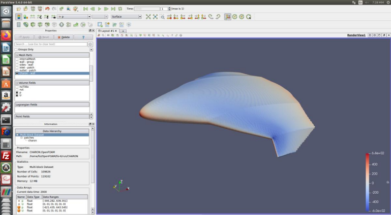
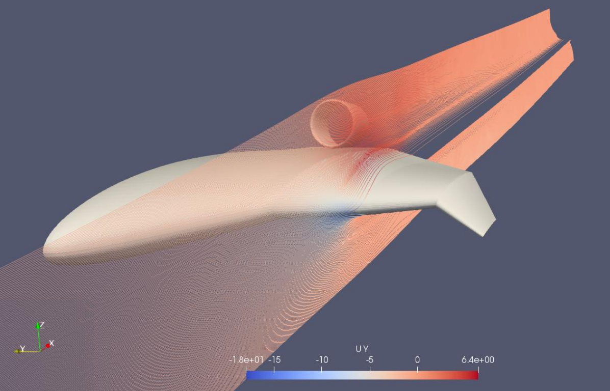
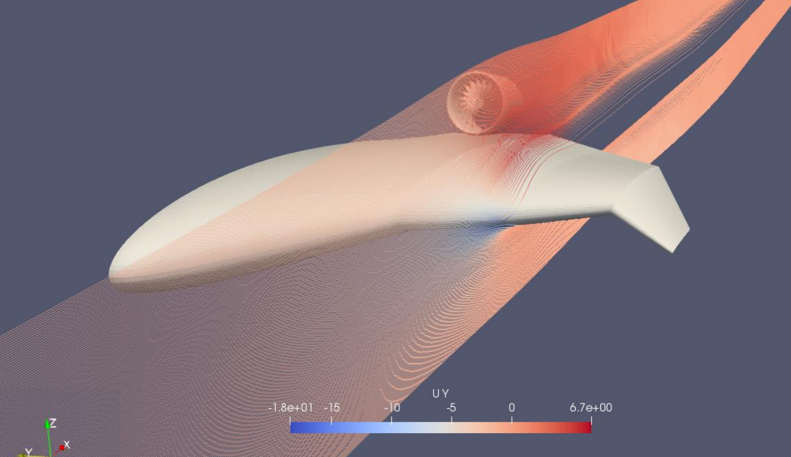

## 2D CFD Validation

Before proceeding to the full three-dimensional aircraft simulations,
two-dimensional CFD results were compared against the aerodynamic
predictions obtained from XFOIL/XFLR5.

The comparison was performed for four airfoil configurations:

- NACA 2412 Standard
- NACA 2412 Reflex05
- NACA 2412 Reflex010
- NACA 2412 Reflex015

For each airfoil, the following quantities were compared across angle
of attack:

- lift coefficient, CL
- drag coefficient, CD
- aerodynamic efficiency, CL/CD

*Representative aerodynamic results used to assess the baseline NACA 2412
airfoil, including 2D CFD–XFLR5 comparisons of lift, drag and aerodynamic
efficiency, together with pitching-moment characteristics.*

### Interpretation

The lift predictions showed good agreement within the approximately
linear pre-stall region.

The principal differences appeared as angle of attack increased.
The XFLR5-based prediction retained its approximately linear lift trend
to substantially higher angles of attack, whereas the CFD solution
predicted the onset of stall earlier.

Larger differences were also observed in drag prediction. Consequently,
XFLR5 predicted a higher maximum lift-to-drag ratio than the CFD model.

The comparison therefore highlighted the limitations of the
lower-fidelity aerodynamic model, particularly in the nonlinear and
post-stall regime, and provided additional justification for proceeding
to higher-fidelity CFD analysis.

---

## 3D Full-Aircraft CFD

Following the two-dimensional airfoil studies, the analysis was extended
to the complete CHARON BWB geometry using OpenFOAM.

The three-dimensional simulations were performed at a reference velocity
of:

**V = 40 m/s (77.75 kt)**

The CFD campaign was structured around three aircraft configurations:

- **C1 — Clean Aircraft:** baseline BWB without nacelles or EDF units
- **C2 — Nacelle Configuration:** aircraft with externally integrated nacelles
- **C3 — Embedded EDF Configuration:** propulsion-integrated configuration
  developed to investigate Boundary Layer Ingestion effects

This progression allowed the aerodynamic impact of propulsion integration
to be evaluated relative to the clean airframe.

---

## C1 — Clean Aircraft

The clean configuration was used as the baseline three-dimensional CFD
case.

*Surface-pressure distribution obtained from the three-dimensional
OpenFOAM analysis of the clean CHARON configuration.*

### Computational Mesh

The full-aircraft computational domain used a mixed unstructured mesh
containing approximately:

- **10 million cells**
- **30 inflation layers**
- near-wall resolution targeting **y+ < 10**

Local mesh refinement was applied around the aircraft geometry to improve
resolution of the near-body flow and boundary-layer region.

The aircraft symmetry plane was also exploited to reduce the computational
domain and computational cost.

### CFD Setup

The OpenFOAM workflow included:

- `snappyHexMesh` for local mesh refinement
- prism/inflation layers near the aircraft surface
- steady-state CFD for the non-rotating configurations
- force and moment extraction using OpenFOAM force/forceCoeffs data
- ParaView for post-processing and flow visualization

The aerodynamic quantities of primary interest were:

- Lift
- Drag
- Pitching Moment
- CL
- CD
- Cm

These quantities were evaluated over multiple angles of attack to examine
the aerodynamic behaviour and longitudinal trim characteristics of the
aircraft.

---

## Clean-Aircraft Trim

The C1 angle-of-attack sweep indicated a near-zero pitching-moment
condition around:

**AoA ≈ 3.9°**

At this condition, the CFD results were approximately:

| Quantity | Value |
|---|---:|
| Angle of attack | 3.9° |
| Lift | 2001 N |
| Drag | 196 N |
| Pitching moment | -34 N·m |
| CL | 0.1556 |
| CD | 0.0152 |
| Cm | -0.00096 |

This condition was therefore used as an important reference point for
subsequent configuration comparisons.

---

## C2 — External Nacelle Configuration

*C2 configuration used to evaluate the aerodynamic effect of the external
nacelles before inclusion of the operating EDF system.*

The second configuration introduced the EDF nacelles on the upper surface
of the aircraft without an operating fan.

This configuration served as an intermediate step between the clean
airframe and the fully propulsion-integrated configuration.

The purpose was to isolate the aerodynamic penalty associated with the
nacelle installation before considering the effect of the EDF flow field.

At an angle of attack of 4°, the configuration produced:

| Quantity | C2 |
|---|---:|
| Lift — aircraft skin | 2000 N |
| Lift — nacelle | 150 N |
| Total lift | 2150 N |
| Drag — aircraft skin | 175 N |
| Drag — nacelle | 48 N |
| Total drag | 223 N |
| L/D | 9.64 |

Relative to the clean configuration, the external nacelle installation
increased the total aerodynamic loading but introduced an additional drag
penalty, reducing the overall lift-to-drag ratio.

---

## C3 — Propulsion-Integrated Configuration

*C3 configuration used to evaluate the aerodynamic effect of the operating EDF system.*

The final configuration incorporated the EDF propulsion system into the
aircraft geometry in order to investigate the aerodynamic interaction
between the propulsion system and the BWB flow field.

Unlike the C2 case, the rotor contribution was included in the force
balance.

At an angle of attack of 4°, the component forces obtained from the CFD
analysis were:

| Component | Lift | Drag |
|---|---:|---:|
| Aircraft skin | 2346 N | 205 N |
| Nacelle | 177 N | -4 N |
| Rotor | 75 N | -214 N |
| **Total** | **2598 N** | **-13 N** |

Because the operating rotor generates thrust, the raw total axial force
is no longer directly equivalent to the passive aerodynamic drag of the
airframe.

For this reason, the aerodynamic comparison reported in the thesis used
the aircraft/nacelle aerodynamic loading separately when evaluating the
configuration-level lift-to-drag behaviour.

## Configuration Comparison

The three configurations were compared at approximately the same flight
condition and an angle of attack of 4°.

| Configuration | Description | L/D |
|---|---|---:|
| C1 | Clean aircraft | 10.33 |
| C2 | External nacelles | 9.64 |
| C3 | Propulsion-integrated / BLI configuration | 12.92 |

The C2 result illustrates the aerodynamic penalty associated with adding
the nacelles without obtaining the full benefit of propulsion–airframe
interaction.

The C3 configuration produced the highest reported configuration-level
lift-to-drag ratio at the analysed condition, increasing L/D from 10.33
for C1 to 12.92.

## Limitations

The results should be interpreted within the scope of the numerical
methodology used in this study.

Key limitations include:

- sensitivity of CFD predictions to mesh resolution and near-wall treatment,
- differences between lower-fidelity XFLR5 predictions and CFD,
  particularly near and beyond stall,
- simplified representation of the propulsion system,
- configuration comparisons performed at selected operating conditions
  rather than across a complete propulsion–airframe operating envelope.

The study was therefore intended primarily as a comparative aerodynamic
investigation of the CHARON configurations rather than as a fully
validated high-fidelity aircraft performance model.
