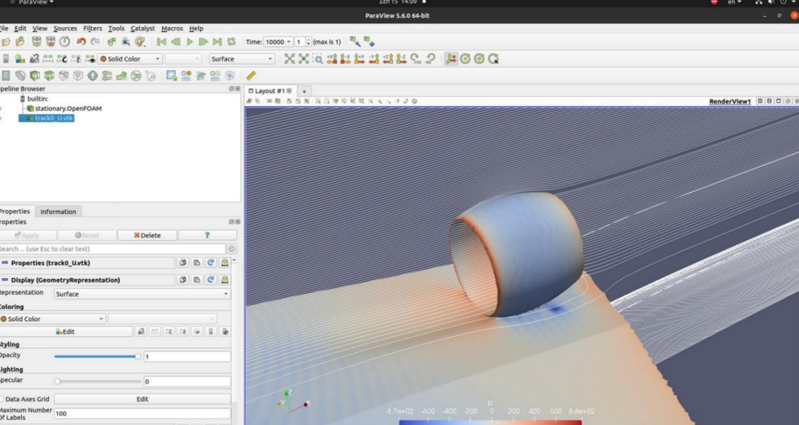
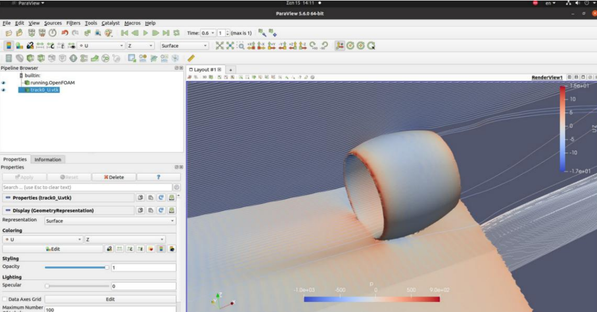

## 2D CFD Validation

Before proceeding to the full three-dimensional aircraft simulations,
two-dimensional CFD results were compared against the aerodynamic
predictions obtained from XFOIL/XFLR5.

The comparison was performed for four airfoil configurations:

- NACA 2412 Standard
- NACA 2412 Reflex05
- NACA 2412 Reflex010
- NACA 2412 Reflex015

For each airfoil, the following quantities were compared across angle
of attack:

- lift coefficient, CL
- drag coefficient, CD
- aerodynamic efficiency, CL/CD

*Representative aerodynamic results used to assess the baseline NACA 2412
airfoil, including 2D CFD–XFLR5 comparisons of lift, drag and aerodynamic
efficiency, together with pitching-moment characteristics.*

### Interpretation

The lift predictions showed good agreement within the approximately
linear pre-stall region.

The principal differences appeared as angle of attack increased.
The XFLR5-based prediction retained its approximately linear lift trend
to substantially higher angles of attack, whereas the CFD solution
predicted the onset of stall earlier.

Larger differences were also observed in drag prediction. Consequently,
XFLR5 predicted a higher maximum lift-to-drag ratio than the CFD model.

The comparison therefore highlighted the limitations of the
lower-fidelity aerodynamic model, particularly in the nonlinear and
post-stall regime, and provided additional justification for proceeding
to three-dimensional CFD analysis of the complete aircraft.

---

## 3D Full-Aircraft CFD

Following the two-dimensional airfoil studies, the analysis was extended
to the complete CHARON BWB geometry using OpenFOAM.

The three-dimensional simulations were performed at a reference velocity
of:

**V = 40 m/s (77.75 kt)**

The CFD campaign was structured around three aircraft configurations:

- **C1 — Clean Aircraft:** baseline BWB without nacelles or EDF units
- **C2 — Nacelle Configuration:** aircraft with externally integrated nacelles
- **C3 — External EDF Configuration:** aircraft with externally mounted
  nacelles and operating EDFs

This progression allowed the aerodynamic impact of propulsion integration
to be evaluated relative to the clean airframe.

---

## C1 — Clean Aircraft

The clean configuration was used as the baseline three-dimensional CFD
case.

*Surface-pressure distribution obtained from the three-dimensional
OpenFOAM analysis of the clean CHARON configuration.*

### Computational Mesh

The full-aircraft computational domain used a mixed unstructured mesh
containing approximately:

- **10 million cells**
- **30 inflation layers**
- near-wall resolution targeting **y⁺ < 10**

Local mesh refinement was applied around the aircraft geometry to improve
resolution of the near-body flow and boundary-layer region.

The aircraft symmetry plane was also exploited to reduce the computational
domain and computational cost.

### CFD Setup

The OpenFOAM workflow included:

- `snappyHexMesh` for local mesh refinement
- prism/inflation layers near the aircraft surface
- steady-state CFD for the non-rotating configurations
- force and moment extraction using OpenFOAM force/forceCoeffs data
- ParaView for post-processing and flow visualization

The aerodynamic quantities of primary interest were:

- Lift
- Drag
- Pitching Moment
- CL
- CD
- Cm

These quantities were evaluated over multiple angles of attack to examine
the aerodynamic behaviour and longitudinal trim characteristics of the
aircraft.

---

## Clean-Aircraft Trim

The C1 angle-of-attack sweep indicated a near-zero pitching-moment
condition around:

**AoA ≈ 3.9°**

At this condition, the CFD results were approximately:

| Quantity | Value |
|---|---:|
| Angle of attack | 3.9° |
| Lift | 2001 N |
| Drag | 196 N |
| Pitching moment | -34 N·m |
| CL | 0.1556 |
| CD | 0.0152 |
| Cm | -0.00096 |

This condition was therefore used as an important reference point for
subsequent configuration comparisons.

---

## C2 — External Nacelle Configuration

*C2 configuration used to evaluate the aerodynamic effect of the external
nacelles before inclusion of the operating EDF system.*

The second configuration introduced the EDF nacelles on the upper surface
of the aircraft without an operating fan.

This configuration served as an intermediate step between the clean
airframe and the fully propulsion-integrated configuration.

The purpose was to isolate the aerodynamic penalty associated with the
nacelle installation before considering the effect of the EDF flow field.

At an angle of attack of 4°, the configuration produced:

| Quantity | C2 |
|---|---:|
| Lift — aircraft skin | 2000 N |
| Lift — nacelle | 150 N |
| Total lift | 2150 N |
| Drag — aircraft skin | 175 N |
| Drag — nacelle | 48 N |
| Total drag | 223 N |
| L/D | 9.64 |

Relative to the clean configuration, the external nacelle installation
increased the total aerodynamic loading but introduced an additional drag
penalty, reducing the overall lift-to-drag ratio.

---

## C3 — Propulsion-Integrated Configuration

*C3 configuration with externally mounted operating EDFs, used to investigate
propulsion–airframe aerodynamic interaction prior to embedded-nacelle
integration.*

The C3 configuration retained the externally mounted nacelle arrangement
of C2 and introduced the operating EDF rotor.

This configuration was used to investigate the aerodynamic interaction
between the operating propulsion system and the BWB airframe before the
subsequent introduction of embedded nacelle recesses and deliberate
Boundary Layer Ingestion.

Unlike the C2 case, the rotor contribution was included in the force
balance.

At an angle of attack of 4°, the component forces obtained from the CFD
analysis were:

| Component | Lift | Drag |
|---|---:|---:|
| Aircraft skin | 2346 N | 205 N |
| Nacelle | 177 N | -4 N |
| Rotor | 75 N | -214 N |
| **Total** | **2598 N** | **-13 N** |

Because the operating rotor generates thrust, the raw total axial force
is no longer directly equivalent to the passive aerodynamic drag of the
airframe.

## Configuration Comparison

The three configurations were compared at approximately the same flight
condition and an angle of attack of 4°.

| Configuration | Description | L/D |
|---|---|---:|
| C1 | Clean aircraft | 10.33 |
| C2 | External nacelles | 9.64 |
| C3 | External nacelles + operating EDF | 12.92 |

The C2 result illustrates the aerodynamic penalty associated with adding
the nacelles without obtaining the full benefit of propulsion–airframe
interaction.

The C3 configuration produced the highest reported configuration-level
lift-to-drag ratio at the analysed condition, increasing L/D from 10.33
for C1 to 12.92.

The rotor contribution introduces net thrust into the axial-force balance.
Consequently, the total axial force reported for C3 should not be interpreted
as passive airframe drag or used directly to reconstruct the configuration
L/D value reported in the thesis.

---

## Embedded-Nacelle / BLI Investigation

Following the externally mounted C2 and C3 configurations, the propulsion
installation was further integrated into the BWB geometry through recessed
embedded nacelles.

The upper surface of the aircraft was locally reshaped to accommodate the
nacelle installation and allow the inlet to interact directly with the
near-wall flow over the BWB.

This configuration was investigated to assess the aerodynamic behaviour of
the aircraft when the EDF installation was deliberately coupled with the
boundary-layer flow.

Two principal cases were considered:

- **C2\*** — embedded nacelle without an operating rotor
- **C3\*** — embedded nacelle with an operating EDF

The C3* configuration was subsequently evaluated at multiple rotor speeds
to investigate the sensitivity of the aerodynamic forces to EDF operating
condition.

### C2* — Embedded Nacelle without Rotor Operation

*C2* embedded-nacelle configuration at AoA = 4°, evaluated without
an operating EDF rotor.*

The embedded configuration was first evaluated without an operating rotor
at an angle of attack of 4°.

The resulting force components were:

| Contribution | Fx [N] | Fy [N] | Fz [N] |
|---|---:|---:|---:|
| Pressure | 67.30 | -380.12 | 1036.05 |
| Viscous | 34.32 | 0.51 | -1.83 |

The reported lift-to-drag ratio for this case was:

**L/D = 10.36**

### C3* — Embedded Nacelle with Operating EDF

*C3* embedded-nacelle configuration at AoA = 4°, evaluated with
an operating EDF rotor.*

The embedded configuration was subsequently evaluated with an operating
EDF at three rotor speeds.

| Case | Rotor speed [rpm] | Fx [N] | Fy [N] | Fz [N] | Reported L/D |
|---|---:|---:|---:|---:|---:|
| C3*-A | 4770 | 119.25 | -286.48 | 1118.73 | 9.39 |
| C3*-B | 5732 | 131.74 | -294.95 | 1160.67 | 8.85 |
| C3*-C | 6687 | 147.70 | -346.79 | 1203.90 | 8.18 |

The rotor-speed sweep showed a systematic increase in the vertical force
component as EDF rotational speed increased.

At the same time, the magnitude of the aerodynamic force associated with
the streamwise/pressure contribution also increased, resulting in a reduction
of the reported L/D across the investigated rotor-speed range:

**9.39 → 8.85 → 8.18**

for:

**4770 → 5732 → 6687 rpm**, respectively.

### Effect of EDF Rotational Speed

Increasing EDF rotational speed increased the suction and altered the
near-body flow around the embedded installation.

The CFD results indicated that increasing rotor speed increased the
generated lift. The flow was also redirected toward the aircraft centreline
and closer to the wing-root region.

Within the investigated operating range, however, the increase in lift was
accompanied by an increase in pressure drag. Consequently, the reported
lift-to-drag ratio decreased as rotor speed increased.

The highest rotor speed therefore did not correspond to the highest
aerodynamic efficiency in the investigated cases.

This illustrates an important propulsion–airframe integration trade-off:
increasing EDF rotational speed can increase aerodynamic loading without
necessarily improving the overall aerodynamic efficiency of the integrated
configuration.

### Flow Attachment

An exploratory embedded-nacelle comparison also indicated a qualitative
difference in internal flow behaviour between the rotor-off and rotor-on
cases.

Without rotor-induced suction, flow separation was observed within the
internal wing/nacelle region. With the EDF operating, the increased mass
flow through the inlet helped maintain a more attached internal flow and
reduced the pressure-drag contribution.

This observation motivated the subsequent controlled rotor-speed study.

## Key Findings

The CFD campaign produced three principal observations:

1. **2D validation:** XFLR5 and CFD showed reasonable agreement in the
   approximately linear pre-stall lift regime, while larger discrepancies
   developed in drag prediction and near stall.

2. **Nacelle integration:** the C2 configuration demonstrated the aerodynamic
   penalty associated with installing the nacelles without an operating EDF,
   reducing the reported L/D from 10.33 to 9.64.

3. **Propulsion integration:** the C3 configuration, with externally mounted
   operating EDFs, produced a reported L/D of 12.92 at the analysed condition,
   compared with 10.33 for the clean configuration. The rotor also introduced
   a significant thrust contribution into the axial-force balance.
   
## Limitations

The results should be interpreted within the scope of the numerical
methodology used in this study.

Key limitations include:

- sensitivity of CFD predictions to mesh resolution and near-wall treatment,
- differences between lower-fidelity XFLR5 predictions and CFD,
  particularly near and beyond stall,
- simplified representation of the propulsion system,
- configuration comparisons performed at selected operating conditions
  rather than across a complete propulsion–airframe operating envelope.

The study was therefore intended primarily as a comparative aerodynamic
investigation of the CHARON configurations rather than as a fully
validated high-fidelity aircraft performance model.

