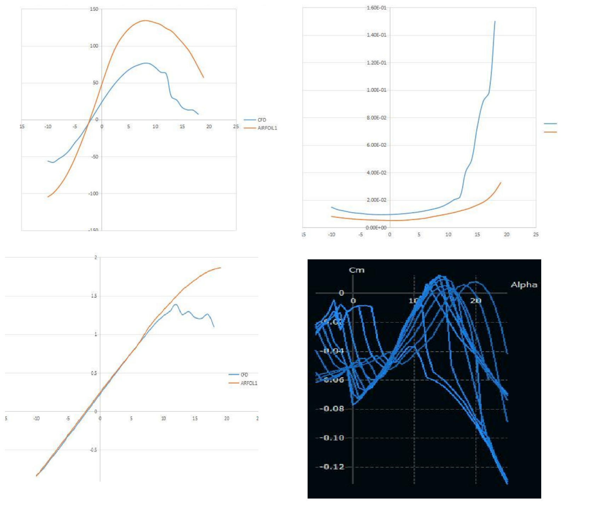

## 2D CFD Validation

Before proceeding to the full three-dimensional aircraft simulations,
two-dimensional CFD results were compared against the aerodynamic
predictions obtained from XFOIL/XFLR5.

The comparison was performed for four airfoil configurations:

- NACA 2412 Standard
- NACA 2412 Reflex05
- NACA 2412 Reflex010
- NACA 2412 Reflex015

For each airfoil, the following quantities were compared across angle
of attack:

- lift coefficient, CL
- drag coefficient, CD
- aerodynamic efficiency, CL/CD

*Representative comparison between 2D CFD and XFLR5 aerodynamic
predictions for the baseline NACA 2412 airfoil.*

### Interpretation

The lift predictions showed good agreement within the approximately
linear pre-stall region.

The principal differences appeared as angle of attack increased.
The XFLR5-based prediction retained its approximately linear lift trend
to substantially higher angles of attack, whereas the CFD solution
predicted the onset of stall earlier.

Larger differences were also observed in drag prediction. Consequently,
XFLR5 predicted a higher maximum lift-to-drag ratio than the CFD model.

The comparison therefore highlighted the limitations of the
lower-fidelity aerodynamic model, particularly in the nonlinear and
post-stall regime, and provided additional justification for proceeding
to higher-fidelity CFD analysis.
