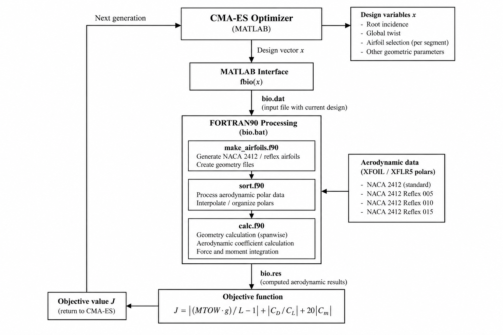

# Aerodynamic & Geometric Optimization

## Overview

The CHARON Blended Wing Body UAV geometry was optimized using a
Covariance Matrix Adaptation Evolution Strategy (CMA-ES).

The optimization framework combined:

- CMA-ES optimization in MATLAB
- custom MATLAB–FORTRAN90 interfacing
- FORTRAN90 geometry and aerodynamic calculations
- XFOIL/XFLR5 aerodynamic polar databases
- NACA 2412 and reflex-airfoil variants
- spanwise discretization of the BWB geometry

The objective was not simply to maximize aerodynamic efficiency.
The optimization simultaneously sought to:

1. generate sufficient lift to support the aircraft weight,
2. minimize aerodynamic drag relative to lift,
3. minimize pitching moment for the tailless BWB configuration.

---

## Why CMA-ES?

The design problem involved multiple interacting geometric variables,
non-linear aerodynamic behavior and a mixed design space including both
continuous geometric parameters and airfoil-selection parameters.

CMA-ES was therefore used as the evolutionary optimization method for
searching the design space.

At every generation, candidate configurations were evaluated through
the aerodynamic/geometric calculation pipeline. Their objective-function
values were then returned to CMA-ES, which updated its search distribution
and generated the next population.

---

## Airfoil Design

The baseline airfoil family was based on the NACA 2412.

Four aerodynamic configurations were considered:

- NACA 2412 STANDARD
- NACA 2412 REFLEX 005
- NACA 2412 REFLEX 010
- NACA 2412 REFLEX 015

The reflex configurations were introduced because the aircraft uses a
tailless Blended Wing Body architecture.

Without a conventional horizontal stabilizer, pitching-moment behavior
becomes an important design consideration. Reflex modification was
therefore investigated as a means of improving the longitudinal
characteristics of the configuration while retaining acceptable
aerodynamic performance.

Aerodynamic polars for the candidate airfoils were generated using
XFOIL/XFLR5 and subsequently used by the optimization framework.

---

## Computational Architecture

The original optimization environment consisted of interacting MATLAB
and FORTRAN90 routines.

A simplified representation of the workflow is:

CMA-ES
    ↓
Candidate design vector
    ↓
MATLAB interface
    ↓
FORTRAN90 geometry / aerodynamic routines
    ↓
Airfoil polar database
    ↓
Spanwise aerodynamic calculation
    ↓
Lift / Drag / Pitching Moment
    ↓
Objective function
    ↓
CMA-ES
    ↓
Next generation

The original implementation included routines for:

- CMA-ES optimization
- MATLAB–FORTRAN data exchange
- NACA 2412 geometry generation
- reflex-airfoil generation
- aerodynamic-polar processing
- spanwise geometric calculations
- force and moment integration
- objective-function evaluation

The complete legacy source code is not distributed in this repository.
This repository instead documents the methodology, computational
architecture and representative engineering results.

*Figure — Computational workflow of the CHARON aerodynamic optimization framework, showing the interaction between CMA-ES, MATLAB, FORTRAN90 routines and the XFOIL/XFLR5 aerodynamic database.*
## Aerodynamic Model

The wing was divided spanwise into multiple segments, which were further
discretized for the aerodynamic calculations.

For each local section, the framework evaluated quantities including:

- local chord
- local incidence
- selected airfoil polar
- lift coefficient
- drag coefficient
- sectional lift
- sectional drag
- pitching-moment contribution

Geometric corrections associated with the three-dimensional wing
configuration were then applied before integrating the sectional
contributions into aircraft-level aerodynamic forces and moments.

---

## Objective Function

Each candidate geometry was evaluated using the following composite
objective function:

J = |MTOW·g / L - 1| + |CD / CL| + 20|Cm|

where:

- MTOW is the aircraft maximum take-off mass,
- g is gravitational acceleration,
- L is calculated aerodynamic lift,
- CL is the lift coefficient,
- CD is the drag coefficient,
- Cm is the pitching-moment coefficient.

### 1. Lift–Weight Matching

|MTOW·g / L - 1|

penalizes configurations whose generated lift differs from the required
aircraft weight.

A configuration with low drag is therefore not considered successful if
it cannot generate the required lift.

### 2. Aerodynamic Efficiency

|CD / CL|

penalizes configurations with poor aerodynamic efficiency.

Minimizing CD/CL corresponds to increasing the lift-to-drag ratio L/D.

### 3. Pitching-Moment Penalty

20|Cm|

strongly penalizes configurations with significant pitching moment.

The weighting factor of 20 reflects the importance assigned to pitching
moment in the optimization of the tailless BWB configuration.

---

## Design Conditions

Representative optimization conditions included:

- MTOW: 205 kg
- reference flight speed: approximately 144 km/h
- Reynolds number: approximately 8.65 × 10^6
- reference wing area: approximately 13.37 m²

The aerodynamic calculations used previously generated airfoil polar
data corresponding to the candidate NACA 2412 configurations.

---

## Optimized Configuration

A representative final CMA-ES solution produced:

| Parameter | Result |
|---|---:|
| MTOW | 205 kg |
| Objective cost | 6.975 × 10^-2 |
| Root incidence | 1.309° |
| Twist | 2.000° |
| Aircraft AoA | 1.461° |
| Lift | 2011.05 N |
| Drag | 122.78 N |
| Pitching moment | -3.041 N·m |
| Cm | -7.25 × 10^-5 |

The resulting spanwise incidence distribution was approximately:

| Station | Incidence |
|---|---:|
| 1 | +1.309° |
| 2 | +1.149° |
| 3 | +0.509° |
| 4 | +0.109° |
| 5 | -0.291° |
| 6 | -0.691° |

The optimized airfoil/polar selections were:

| Wing Segment | Polar Selection |
|---|---:|
| Segment 1 | 4 |
| Segment 2 | 3 |
| Segment 3 | 3 |
| Segment 4 | 3 |
| Segment 5 | 1 |

These parameters were subsequently available for implementation in the
aircraft geometry and further aerodynamic investigation.

---

## Engineering Interpretation

The optimization illustrates the coupled nature of BWB aerodynamic
design.

Maximizing lift-to-drag ratio alone would not adequately describe the
design problem. The aircraft also had to:

- generate sufficient lift at the selected flight condition,
- maintain acceptable pitching-moment characteristics,
- accommodate the aerodynamic behavior of a tailless configuration,
- produce a feasible spanwise geometry.

The resulting optimization therefore represents a multi-objective
engineering trade-off expressed through a single weighted cost function.

---

## Tools

- MATLAB
- FORTRAN90
- CMA-ES
- XFOIL
- XFLR5

---

## Next Stage

The optimized aerodynamic configuration was subsequently used as the
basis for higher-fidelity three-dimensional analysis and propulsion
integration studies.

See:

- `/cfd`
- `/propulsion`
- `/results`
