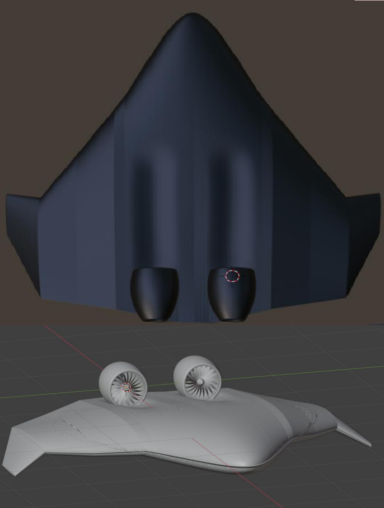

# Propulsion Integration

The CHARON propulsion concept was developed around two electrically driven
ducted-fan units integrated on the upper surface of the Blended Wing Body.

Rather than treating propulsion as an independent subsystem added after the
aerodynamic design, the project investigated the interaction between the EDF
installation, nacelle geometry and the flow field over the aircraft.

The propulsion study evolved through two principal installation concepts:

1. **External nacelle installation** — nacelles positioned tangentially on the
   upper surface of the BWB.
2. **Embedded nacelle installation** — the upper aircraft surface was locally
   reshaped to recess the nacelles and investigate Boundary Layer Ingestion.

This progression allowed the effects of nacelle installation, rotor operation
and geometric integration to be investigated separately.

## EDF Architecture

The propulsion system consisted of two symmetric Electric Ducted Fan units
installed on the upper surface of the aircraft.

The principal geometric characteristics used in the study included:

- two EDF units
- symmetric installation about the aircraft longitudinal axis
- approximately 0.5 m lateral distance from the longitudinal centreline
- nacelle outer diameter: **0.5 m**
- nacelle section based on **NACA 0012**
- **21-blade rotor**

For the externally mounted operating-EDF configuration, a nominal rotor
speed of **5500 rpm** was investigated.

## External Installation

The initial propulsion configuration positioned the nacelles externally
on the upper surface of the aircraft without recessing them into the BWB
geometry.

This configuration provided an intermediate integration stage in which the
aerodynamic effect of the nacelles could first be evaluated independently
and subsequently compared with operation of the EDF rotor.

Two CFD configurations were derived from this architecture:

- **C2:** external nacelles, rotor off
- **C3:** external nacelles, rotor operating at 5500 rpm

The detailed aerodynamic results of these configurations are documented
in [`cfd/`](../cfd/).

## Embedded Nacelle Concept

The second installation concept modified the upper BWB surface to partially
embed the nacelles into the aircraft geometry.

The recessed geometry was developed to allow the propulsion inlet to interact
more directly with the near-wall flow over the upper surface.

This configuration formed the basis of the project's Boundary Layer Ingestion
investigation.

The embedded installation was analysed both without rotor operation and with
an operating EDF over multiple rotational speeds:

- **0 rpm** — embedded nacelle, rotor off
- **4770 rpm**
- **5732 rpm**
- **6687 rpm**

The objective was not only to evaluate thrust generation, but also to examine
how rotor-induced suction and mass-flow ingestion altered the aerodynamic
behaviour of the integrated aircraft.

## Installation Evolution

*Evolution of the CHARON propulsion installation from externally mounted
nacelles to the recessed configuration investigated for Boundary Layer
Ingestion.*

## Engineering Objective

The propulsion study was structured to separate three coupled effects:

- the aerodynamic penalty introduced by the nacelle geometry,
- the influence of an operating EDF on the surrounding flow field,
- the effect of embedding the propulsion system into the BWB boundary-layer
  region.

This distinction was important because improvements or penalties observed
in the integrated configuration cannot be attributed to rotor operation,
nacelle geometry or Boundary Layer Ingestion independently without comparing
the corresponding intermediate configurations.

The resulting CFD investigation and quantitative configuration comparisons
are documented in [`cfd/`](../cfd/).
